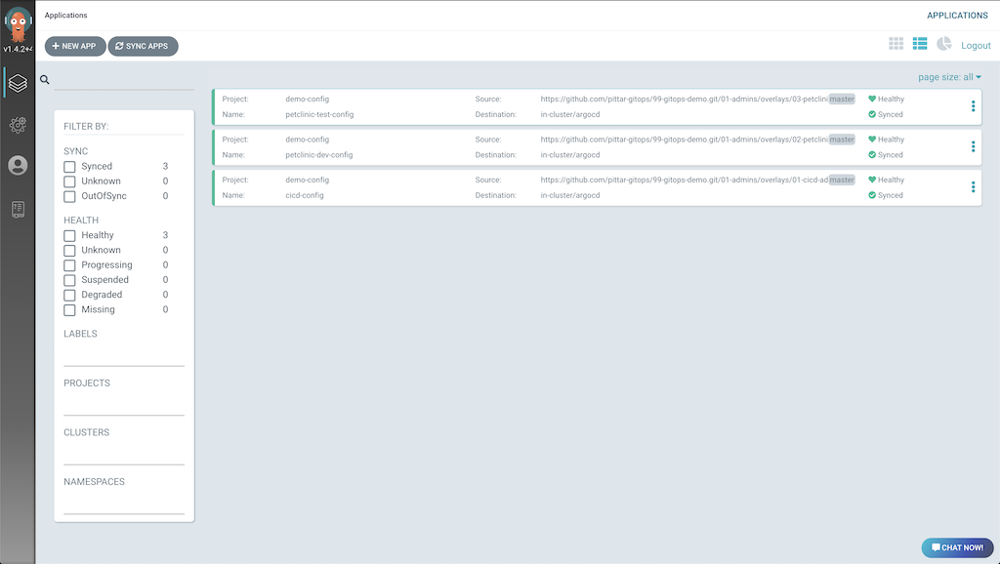
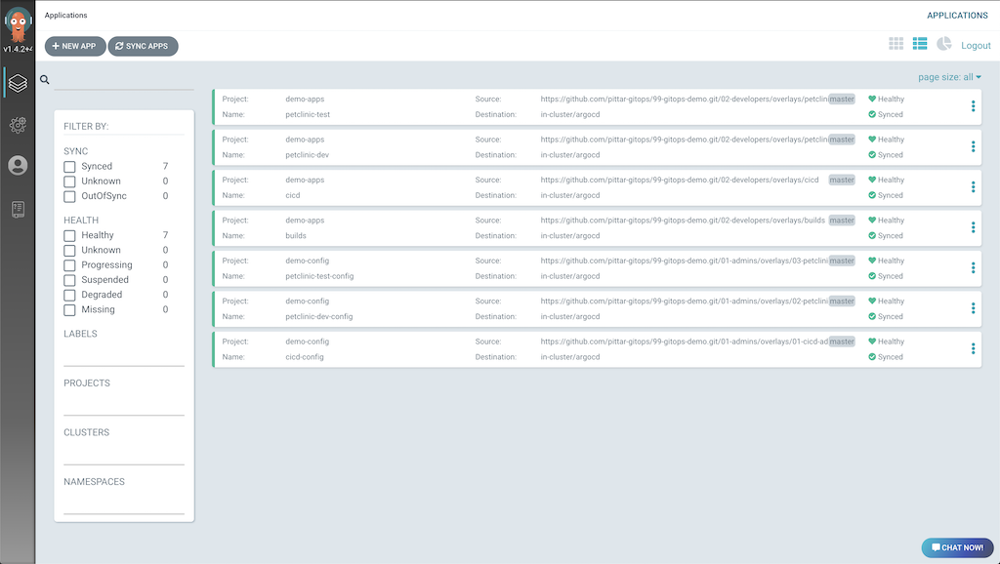
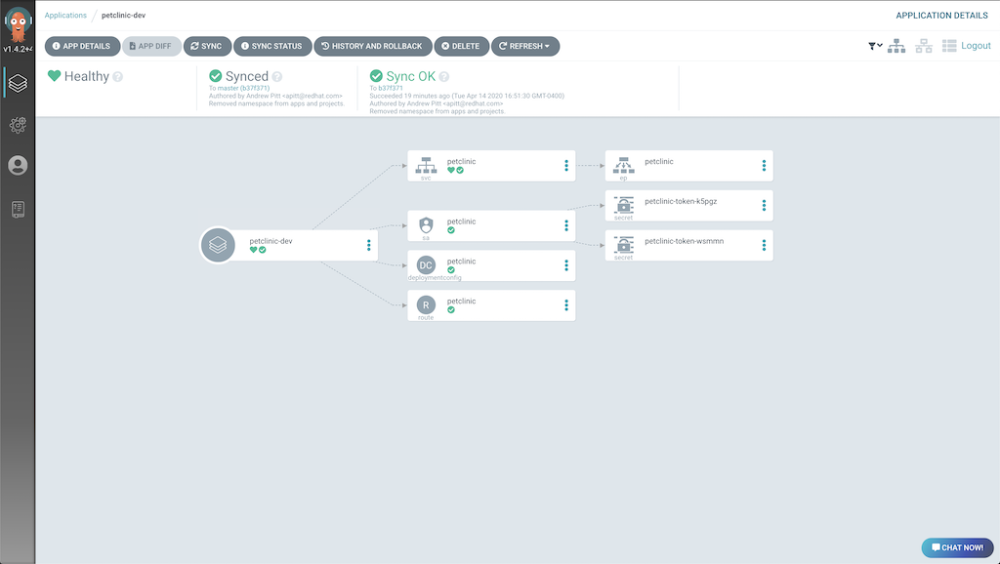

# OpenShift GitOps Demo: Kustomize and Argo CD

A small GitOps demo on [OpenShift](https://openshift.com) using [Kustomize](https://github.com/kubernetes-sigs/kustomize) for manifest customization/templating and [Argo CD](https://argoproj.github.io/argo-cd/) to manage OpenShift cluster configuration, environments, and applications based on the Kustomize resources.

## What's Included

* Argo CD - Both the Operator and an Argo CD server
* CI/CD tools - Only Jenkins for the demo
* Jenkins pipeline and *source-to-image* binary build to create a container image.
* Demo App (Spring Petclinic)
* Resource Quotas, Limits, NetworkPolicies... oh my!

## Prerequisites

* An [OpenShfit Container Platform 4.x cluster](https://try.openshift.com) with `cluster-admin` rights, **OR**
* [CodeReady Containers 1.6+](https://developers.redhat.com/products/codeready-containers/overview) - It's free!  Sign up for a free Red Hat account to download and install CodeReady Containers on your local machine.
* [oc command line tool](https://mirror.openshift.com/pub/openshift-v4/clients/ocp/latest/) or `kubectl`

If you choose to use [CodeReady Containers 1.6+](https://developers.redhat.com/products/codeready-containers/overview) you will be running full fledged OpenShift 4 cluster, as well as Argo CD, Jenkins, Maven builds, container image builds, and two application environments, this demo does need a decent amount of resources.  This is the CodeReady Containers configuration that I have tested this demo on locally:

```
$ crc config view
- cpus                                  : 4
- memory                                : 12288
- nameserver                            : 
- pull-secret-file                      : /Users/pitta/Utils/crc/pull-secret.txt
- vm-driver                             : hyperkit
- warn-check-bundle-cached              : true
```

If you need to increase the number of cpu cores or memory your CodeReady Containers instance uses, run the commands:
```
$ crc config set cpus 4
$ crc config set memory 12288
```

Of course, if you have more CPU or Memory, you can bump those numbers up accordingly.  Please note the **cpu** number is *hyper-threded cores*.  For example, a 4-core Intil i7 would have 8 hyper-threaded cores.  In this scenario, giving CodeReady Containers *4 cpus* would allocate it half of the CPU resources of your computer.

## Clone the Demo Repository

Clone this repository and change to the `99-gitops-demo` directory.

```
$ git clone https://github.com/pittar-gitops/99-gitops-demo.git
$ cd 99-gitops-demo
```

## Install Argo CD Operator and Instance

### 1. Login with the oc command line tool

Login to your cluster using the `oc` cli tool as a cluster admin.  If you are using CodeReady Containers, you can use the `kubeadmin` username and password supplied when you start your instance.  

For example, the login command printed when CodeReady Containers starts should look something like:

```
$ oc login -u kubeadmin -p <password> https://api.crc.testing:6443
```

If you are using a real OpenShift 4.x cluster, or OKD 4 cluster, you can find the login command from the OpenShift UI by clicking on your username in the top-right corner of the screan and select "Copy Login Command".

### 2. Install Argo CD

The installation of the Argo CD operator and the creation of an Argo CD server instance are handled by the `setup-argocd.sh` script.

Run:

```
$ ./setup-argocd.sh
```` 

and wait for the script to complete.  It will take a few minutes to install the operator, then create an Argo CD server instance.

* If you are using Windows, you can simply copy/paste the `oc` commands and run them from DOS, Powershell, or another terminal such as Cygwin or Linux Subsystems for Windows.
* If you want to use `kubectl` instead of `oc`, first create the `argocd` project, then manually run the `oc` commands using `kubectl` instead.

**Sneak Peek:** The script is really just two *kustomize* commands (`oc apply` with the `-k` flag).  The first command creates the [Argo CD Operator](https://github.com/argoproj-labs/argocd-operator), the second creates an instance of Argo CD that is pre-configured to use OpenShift OAuth.

### 3. Login to the Argo CD Console

Login to the Argo CD console:
* To get the URL for your server, run:
```
$ oc get route argocd-server -n argocd
```  
* Open the URL in a browser tab.  You will have to accept the self-signed certificate.
* Login with your OpenShift username and password

Your Argo CD console will be empty for now, but you will fill it up soon!

### 4. Login to the OpenShift Console

Login to the OpenShift UI as a user that can view the namespaces Argo CD is about to create.

If you are using CodeReady Containers, you can open a new browser tab to the UI with the following command:
```
$ crc console
```  

**Note:** With CodeReady Containers you will have to accept the self-signed certificate.  You can login using the `kubeadmin` username and password printed in the terminal when CodeReady Containers finished booting.

Make sure you are in the **Developer** perspective (change this at the top of the left navigation panel).  The rest of the instructions assume you are in this view.

## Install Demo

Here we are going to use Kustomize to setup both the *administrator* and *developer* infrastructure required for ths demo in Argo CD.

Although this demo is greatly simplified, the general idea is that *cluster admins* will have their own set of repositories that control cluster and project-specific configuration (OAuth config, security controls, project resource quotas and limits, etc...).  *Developers* will have their own set of repositories that will be limited to configuration specific to their projects (Deployments, Services, Persistent Volume Claims, etc...).

At the end of this demo, you can start over and strictly use the existing Kustomize resources if you want to see how to provision the same infrastructure without using Argo CD.

### 1. Configure the Admin Projects and Applications

From the command line, run the following command to create the administrator [Projects](https://argoproj.github.io/argo-cd/user-guide/projects/) and [Applications](https://argoproj.github.io/argo-cd/operator-manual/declarative-setup/#applications) in Argo CD.

```
$ oc apply -k 01-admins/overlays/00-argocd/admins/
```

This will find the `kustomization.yaml` file in the specified directory and apply the `resources` that are listed.  The file looks like this:

```
apiVersion: kustomize.config.k8s.io/v1beta1
kind: Kustomization
namespace: argocd
resources:
- 00-demo-config-project.yaml
- 00-demo-apps-project.yaml
- 01-cicd-admin-config-app.yaml
- 02-petclinic-dev-admin-config-app.yaml
- 03-petclinic-test-admin-config-app.yaml
```

Since the the `kustomization.yaml` file also specifies a *namespace* of `argocd`, this namespace will be added to each of the resources.

So, what just happened?

First, two Argo CD [Projects](https://argoproj.github.io/argo-cd/user-guide/projects/) were created.  One project for *admin* related activities and one for *developer* related activities.  Argo CD *Projects* are a convenient way to group Argo CD *Applications* (explained next).  *Projects* also determine what *cluster* and *namespace* resources the *Applications* may or may not control, what cluster the appliations are meant for, and what git repositories can be referenced.

Looking at the `demo-apps` project, you can see there are certain resources that are black listed.  In this case, developers aren't allowed to modify network policies, change resource quotas/limits, or manage cluster-scoped resources.

```
apiVersion: argoproj.io/v1alpha1
kind: AppProject
metadata:
  name: demo-apps
spec:
  clusterResourceBlacklist:
  - group: '*'
    kind: '*'
  namespaceResourceBlacklist:
  - group: ''
    kind: ResourceQuota
  - group: ''
    kind: LimitRange
  - group: 'networking.k8s.io'
    kind: NetworkPolicy
  destinations:
  - namespace: '*'
    server: '*'
  sourceRepos:
  - '*'

```

Second, there were three [Applications](https://argoproj.github.io/argo-cd/operator-manual/declarative-setup/#applications) created.  Argo CD *Applications* reference a git repository and context path where Kubernetes manifests (or Helm charts) can be found.  The lifecycle of these manifests in the target cluster is then managed by Argo CD.  

Here is an example of the `petclinic-dev` application:

```
apiVersion: argoproj.io/v1alpha1
kind: Application
metadata:
  name: petclinic-dev
spec:
  destination:
    namespace: argocd
    server: https://kubernetes.default.svc
  project: demo-apps
  source:
    path: 02-developers/overlays/petclinic-dev
    repoURL: https://github.com/pittar-gitops/99-gitops-demo.git
    targetRevision: master
  syncPolicy:
    automated:
      prune: false
      selfHeal: true
```

The important parts to note in the Application above:
* The `source` stanza specifies the git repository and path within it where the application manifests can be found.
* The `destination` stanza specifies the cluster this application is deployed to, and the namespace where the *Application* custom resource will be created.
* The `project` specifies the Argo CD *Project* this *Application* belongs to.
* The `syncPolicy` determins if Argo CD should automatically keep manifests in sync or not.
    * `prune`: Set this to `true` if you want Argo CD to delete resources that are *not* managed by Argo CD.  Use with caution!
    * `selfHeal`: Set this to `true` to allow Argo CD to reconcile differences between manifests in git and those in the cluster.

The three applications that were created by the command above are:
* CICD Admin Config: CICD namespace, network policies, and Jenkins role binding.
* Petclinic DEV Admin Config: Petclinic DEV namespace, network policies, compute quota/limit, Jenkins role binding.
* Petclinic TEST Admin Config: Petclinic TEST namespace, network policies, compute quota/limit, Jenkins role binding.

As you can see, these tasks often associated with a "cluster administrator".  As such, the git repository that manages these applications and manifests would be controled by the cluster administrators.

The Argo CD admin console will now list three applications.



Now that the cluster has been configured with three new namespaces (cicd, demo-dev, demo-test) and standard configurations (network policy, quotas, role bindings, etc...), it's time to populate these projects.

### 2. Configure the Developer Applications

Argo CD *applications* are custom resources that point to a git repository and the path within that repository where the manifests for your application (or any kind of Kuberntes resources) reside.

Once again, we will use the Kustomize functionality built into the `oc` command line tool (or `kubectl`) to popluate our new namespaces.

From the command line, run the following command:

```
$ oc apply -k 01-admins/overlays/00-argocd/developers/
```

This time around there are no Argo CD *Projects* to create, but there are four more Argo CD *Applications*.  These are:
* CICD Developer: Configure CI/CD tools on the cluster.  In this case, just Jenkins 2.
* Petclinic DEV: Petclinic DEV environment, including DeploymentConfig, Service, ServiceAccount, and Route.
* Petclinic TEST: Petclinic TEST environment, including DeploymentConfig, Service, ServiceAccount, and Route.
* Petclinic Builds: Source-to-Image BuildConfig, Jenkins Pipeline BuildConfig, and Petclinic ImageStream.

Now, your Argo CD UI should have 7 applications.  Some may still by synchronizing, so wait a moment until they are all green.  Your UI should look something like this:



Now that we have populated the cluster, you can click in and take a look at what has been created in these apps.  If you look at the `petclinic-dev` application in the `demo-apps` project, you will see that a number of objects have been created.  But where did they come from?



Well, if you look at the definition of the `petclinic-dev` application, you will see it points to a particular git repository and context path, namely [https://github.com/pittar-gitops/99-gitops-demo.git and /02-developers/overlays/petclinic-dev](https://github.com/pittar-gitops/99-gitops-demo/tree/master/02-developers/overlays/petclinic-dev).  In here you will find two things:
1. Another `kustomization.yaml` file
2. A `deploymnetconfig-patch.yaml` file.

Just like `oc` and `kubectl`, Argo CD is happy to use Kustomize!  This is great, since it's a standard Kubernetes tool that cuts out duplication and greatly simplifies templating.  This kustomization file does three things:
1. It points to a generaic **bases** directory, where the generic kubernetes yaml files can be found for the Petclinic app.
2. Tells Kustomize what namespace needs to be added to these resources.
3. Patches the image name that the "dev" version of the DeploymentConfig will use.

Looking at the bases directory that is referenced, you can see the list of resources is a standard set of yaml files to run and expose an app.  When using Kustomize, you do need a `kustomization.yaml` file in this directory as well to tell Kustomize what files to include.

Just like using Kustomize from the `oc apply -k` or `kubectl apply -k`, Argo CD handles kustomization.yaml files the same way.  Not only does this mean that apps you already have setup to use Kustomize can be easily managed by Argo CD, but it also means that any app you develop with Argo CD in mind can also be easily deployed simply using Kustomize.  Bonus!

Before we move on, there is one other cool Kustomize feature to call attention to, the ability to use remote bases!

If you dig through this git repository and try to find the Jenkins manifests, you will come up empty.  This is becasue for Jenkins I am pointing to bases in a completely different git repository.  This is another great feature and can help you create "libraries" of applications or tools that can be easily referenced rather than copy/paste reproduced.  Since you can add/patch/update almost anything with Kustomize, it's easy to create a generic base that can be used for many different purposes.

If you look at the *CICD* overlay, you'll see it looks like this:

```
apiVersion: kustomize.config.k8s.io/v1beta1
kind: Kustomization
namespace: cicd
bases:
- github.com/redhat-canada-gitops/10-devtools/jenkins2/overlays/m2-pvc?ref=master
# If you want to use Nexus2 as well, delete the line above and uncomment the lines below.
#- github.com/redhat-canada-gitops/10-devtools/jenkins2/overlays/nexus2-settings?ref=master
#- github.com/redhat-canada-gitops/10-devtools/nexus2/base?ref=master
```

Here we still specify the `namespace` that we want to set in all of our manifests, but we also list one (or more) remote bases to reference.  Woot!

### Run a Build and Deploy to DEV and TEST

Ok... now that we have configuration set for DEV and TEST.

If you noticed when you were looking around, one of the applications that was created is for *petclinic builds*.  This creates an *ImageStream* to track the Petclinic container images, a *Jenkins Pipeline* build to compile, test and deploy the appliation, and a *source-to-image* build that Jenkins will use to build a new container image from the executable jar that the Maven build produces.

Let's kick this process off!

In the OpenShift console, navigate to the **cicd* project.  From the *Developer* perspective (if your console says "Administrator" in the top-left corner of the UI, then click on that text and change to "Developer"), click on **Builds -> petclinic-jenkins-pipeline**, then from the **Actions** drop down near the top-right select *Start Build*.

A lot is about to happen, most of it out of the scope of GitOps and Argo CD!  In fact, in this scenario, the GitOps part of the process is complete.  What has our GitOps process (made possible by Kustomize and Argo CD) done for us?  It has:
1. Configured three new namespaces (environments) for use:  cicd, demo-dev, demo-test
2. Configured administrative details about these environments such as network policies, resource quotas and limits, and role bindings.
3. Configured and deployed CI/CD tools (ok... just Jenkins, but you can easily add other tools like Nexus, SonarQube, Selenium Hub, etc...)
4. Configured the "DEV" Petclinic environment, including setting the proper route URL and container image to use in DEV.
5. Configured the "TEST" Petclinic environment, including setting the proper route URL and container image to use in TEST.
6. Created builds and pipelines to compile, test, build, and deploy the Petclinic application across two environments.

Not bad! GitOps is quite useful!  

So, what is the build that we just kicked off responsible for?  Well:
1. It clones the code repository (always separte from the gitops repository).
2. Spins up a Maven Jenkins agent to compile and test the code.
3. Triggers the *source-to-image* build to make a new container image, tagged as "latest", from the Petclinic jar file.
4. Tags the new image with the "DEV" tag and starts a rollout (deployment) in the "demo-dev" environment.
5. Tags the "DEV" image with the "TEST" tag and starts a rollout (deployment) in the "demo-test" environment.

If you want to follow the build logs, you can click the "view logs" link in the pipeline.  This will bring you to the Jenkins build log for this build.  You will have to login to Jenkins with your OpenShift credentials, as it is fully integrated with OpenShift OAuth.

Done!  In only a few minutes we have gone from a completely empty cluster to a cluster with properly configured environments, CI/CD tools, builds, and running instances of an application!

## Conclusion

Although this is a simple demo, it gives you a sense of how GitOps can fit into a well balanced CI/CD diet!
